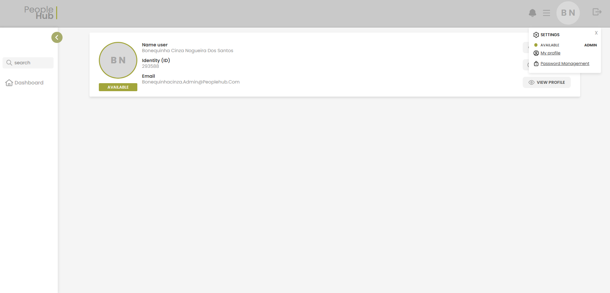
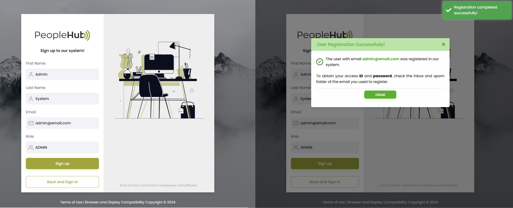
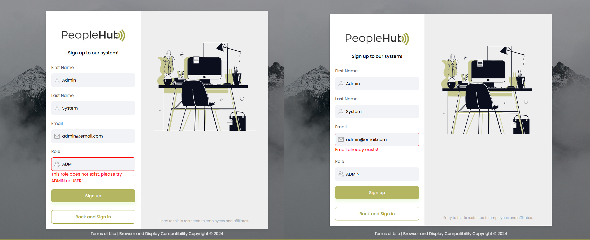
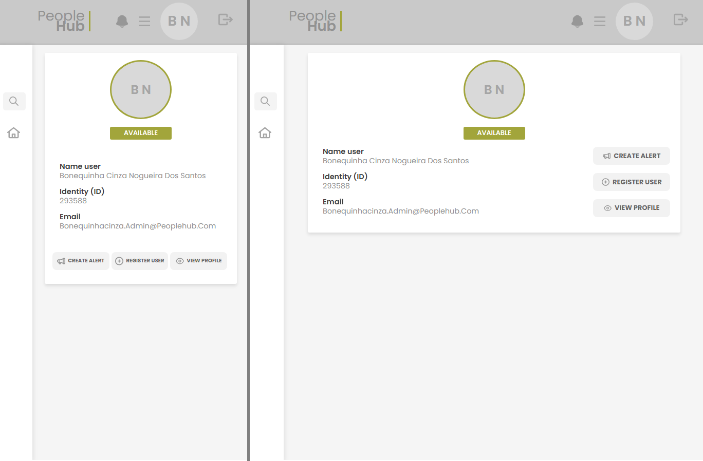

# Login Screen (with authentication and authorization)

Implementation of an HR System for my development as a Full Stack.

💻 Technologies used: 
Angular
 
Typescript
 
SCSS
 

Screen Login: 

  
Screen Dashboard User with ROLE ADMIN: 

  

  
Screen Signup:  

  
Validations: 

  
Screen Responsive: 

 

🔗 Link figma: https://www.figma.com/design/8abn9FA0Kq7MACo9gPe4rc/Untitled?node-id=0-1&t=4GH42ISO98QY86lB-0
 
🔗  Link API Backend: https://github.com/devluanna/api-login-angular

✅ What we have already implemented:
 
👥 - Login with authentication and authorization
 
👤 - User Page
 
➕ - Registration page with validations and modal
 
🔓 - Password recovery
 
✉️ * Use real email to register. There is an implementation in the API that when you register, an email is sent with your ID and password to log in.*
  
This project is based on the structure of a project by Developer Fernanda Kipper
 
🔗 Video link: https://www.youtube.com/watch?v=6qbuuPM_de4&t=583s
 
 

❌ Upcoming Features:
 
- Information update
- Password update

